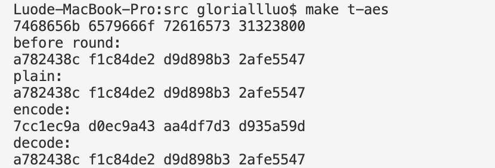
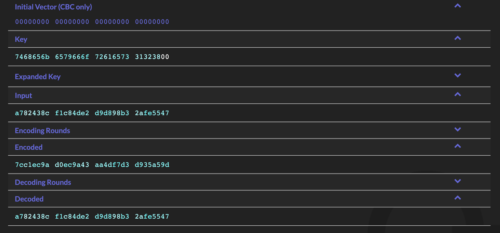
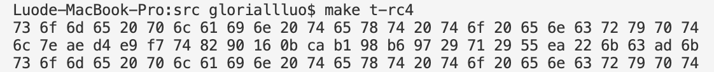
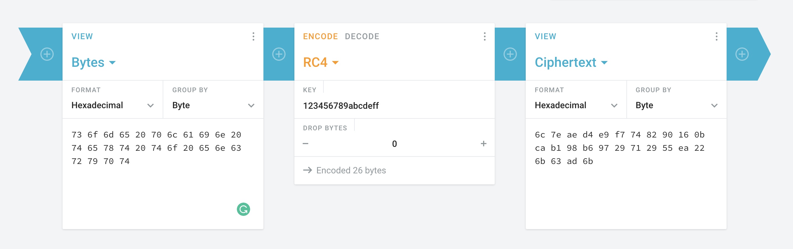

# 3-Ciphers Report

计86 罗境佳 2018013469

*代码文件位于 `src` 文件夹下。*

## AES-128-CBC

### 实现

-   代码文件：`aes128.h` 、 `aes128.cpp`
-   使用一个 `__uint_128_t` 代表一个状态，按照课件和文献的说明实现了 `keyExpansion` 、 `subBytes` 、 `shiftRows` 、 `mixCols` 、 `addRoundKey` 等函数。
-   S 盒、逆 S 盒以及 xtime 还有 Key Expansion 时的常数矩阵采用硬编码写死在代码中以节省时间。
-   Key Expansion：采用文献中的方法实现，见 `aes128.h` 中的 `keyExpansion` 函数。
-   Sub Bytes：利用 `S` 数组，将 state 的每个字节进行映射。
-   Shift Rows：见 `shiftRows` 函数，state 按行存储，将其地址转换成 `u8*` 并进行轮换赋值。
-   Mix Columns：矩阵乘法的实现见 `aes128.h` 的 `mixCols` 以及 `invMixCols` 函数，其中与 3、9、b、d、e 的乘法也基于 xtime 实现，见 `aes128.h` 中的一些宏定义。
-   CBC：见 `main` 函数，具体做法是每个分组在 encode 之前与上一个分组的 encode 结果相异或，decode 后与上一个分组的 encode 结果相异或。

### 正确性

-   与 [AES Step-by-Step](https://www.cryptool.org/en/cto/aes-step-by-step) 中的结果进行了对比，运行方式为 `make t-aes`。

-   我的运行结果：

    

-   AES Step-by-Step 的结果：

    

### 效率

-   运行方式为 `make aes`。
-   结果为 106.3896 Mbps。

## RC4

###  实现

-   代码文件：`rc4.cpp`。
-   KSA 过程：依据 key 对 S 盒进行充分交换，见 `KSA` 函数。
-   PRGA 过程：生成与明文等长的密文，见 `PGRA` 函数。

### 正确性

-   与 [Cryptii](https://cryptii.com/pipes/rc4-encryption) 中的结果进行了对比，运行方式为 `make t-rc4`。

-   我的运行结果：

    

-   Cryptii 中的结果：

    

### 效率

-   运行方式为 `make rc4`。
-   结果为 862.3158 Mbps。

## SHA-3-256

### 实现

### 正确性

### 效率

## 参考文献

*注：算法效率通过运行10次并取平均所得，采用了-O1优化。*
